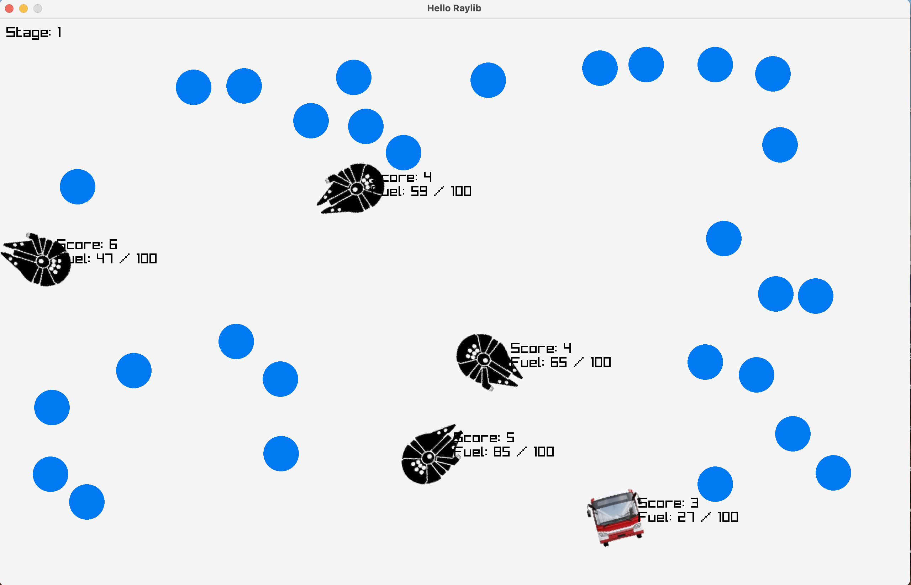

<<<<<<< HEAD
# Bus Game



## Overview
This is a bus-themed game built with [raylib](https://www.raylib.com/). Control a fleet of buses as they race to collect targets, refuel, and compete for the highest score. The game features multiple stages, fuel management, and dynamic bus behavior.

## How to Build & Run

### Prerequisites
- [raylib](https://www.raylib.com/) (automatically fetched if not found)
- [CMake](https://cmake.org/) (version 3.17 or higher)
- C++ compiler (C++11 or higher)

### Build Steps
1. **Clone this repository**
2. **Open a terminal in the project root**
3. **Run the following commands:**
   ```sh
   mkdir build && cd build
   cmake ..
   cmake --build .
   ```
4. **Run the game:**
   - On most systems: `./raylib_quickstart_main_forreal`
   - On Windows: `raylib_quickstart_main_forreal.exe`

### Resource Directory
The game uses a `resources` folder for images and assets. The executable will search for this folder in several common locations (working directory, app directory, up to 3 levels above). Make sure the `resources` folder is present in the project root or next to the executable.

## Gameplay
- **Objective:** Control a fleet of buses to collect as many blue targets as possible before running out of fuel.
- **Buses:** Each bus moves toward a target. When a bus collects a target, it refuels and scores a point. If a bus runs out of fuel, it starts wandering randomly.
- **Stages:** Every 20 seconds, the stage increases. Buses are ranked by score, and the lowest-scoring bus is removed. Top buses get a fuel capacity bonus (up to a max).
- **Power-ups:** Buses occasionally get a speed boost for a short duration.
- **Game Over:** The game continues until only one bus remains.

## Controls
- The game is fully automated; buses are AI-controlled. Just watch the action unfold!
- Close the window to exit.

## Credits
- Built with [raylib](https://www.raylib.com/)
- Resource directory helper by Jeffery Myers (MIT License)

---

Enjoy the game!
=======
# Autonomous Agent Project


## Overview

This project simulates autonomous buses navigating a 2D environment to collect fuel targets. Each bus moves towards fuel pickups to avoid running out of fuel, and when fuel is depleted, buses enter a wandering state until they refuel. The simulation is built using [Raylib](https://www.raylib.com/) for rendering and input handling.

## Features

- Multiple autonomous bus agents with fuel management.
- Intelligent targeting system for fuel pickups.
- Wandering behavior when buses run out of fuel.
- Speed boost power-up mechanic.
- Scoring system based on pickups collected.
- Dynamic stage progression with target resets and bus upgrades.

## Controls

- The simulation runs automatically once started.
- Observe bus behaviors as they collect fuel and avoid running out.

## Dependencies

- C++11 or later compiler.
- [Raylib](https://www.raylib.com/) — simple and easy-to-use library to enjoy videogames programming.

## How to Install Raylib
## macOS
Install Raylib using Homebrew:
brew install raylib
Linux (Ubuntu/Debian)

### Option 1: Install from Package Manager (if available)
sudo apt-get update
sudo apt-get install libraylib-dev

### Option 2: Build from Source
sudo apt-get update
sudo apt-get install build-essential git cmake libglfw3-dev libopenal-dev libpthread-stubs0-dev libx11-dev libxcursor-dev libxi-dev libxrandr-dev libxinerama-dev libudev-dev libasound2-dev libpulse-dev

git clone https://github.com/raysan5/raylib.git
cd raylib
mkdir build && cd build
cmake ..
make
sudo make install
### On Windows

1. Download the Raylib installer or precompiled binaries from the [Raylib releases page](https://github.com/raysan5/raylib/releases).
2. Follow the instructions included for setting up the library with your IDE or build system.

Alternatively, install via **vcpkg**:

```bash
git clone https://github.com/microsoft/vcpkg.git
cd vcpkg
.\bootstrap-vcpkg.bat
vcpkg install raylib
>>>>>>> d3e2938e8ff75ef9292c6cc311917ba81a67c834
